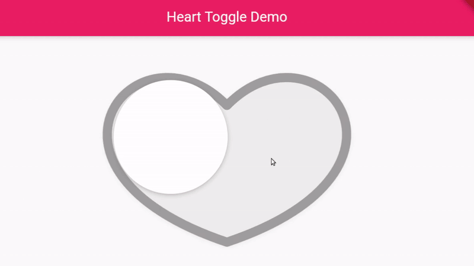

# heart_toggle 

A Flutter package for heart shapped toggle.



###  Getting Started

1. First add heart_toggle package to your pubspec dependencies.

2. To import heart_toggle:
   ```dart
   import 'package:heart_toggle/heart_toggle.dart';
   ```
3. To use:
   ```dart
   HeartToggle(    
        props: HeartToggleProps(
              size: 40.0,
              passiveFillColor: Colors.grey[200]!,
              ballElevation: 4.0,
              heartElevation: 4.0,
              ballColor: Colors.white,
              onChanged: (toggled) => {},
            ),
          )
   ```

### Properties and Default Values
- `isActive` : `false`
- `activeFillColor` : `0xfffe8da5` (Pink, kind of)
- `activeStrokeColor` : `0xffe75776` (Dark pink, probably)
- `passiveFillColor` : `Colors.white54`
- `passiveStrokeColor` : `Colors.grey`
- `size` : `40` ( 40 is taken as the height and 40 x 1.4 is width)
- `strokeWidth` : `'size' / 20` (Eg: 40/20 = 2)
- `onTap` : `null`
- `onChanged` : `null`
- `ballColor` : `Colors.white`
- `heartElevation` : `null`
- `heartShadowColor` : `Colors.grey` (only applicable when '`heartElevation`' is not null)
- `ballElevation` : `4.0`,
- `ballShadowColor` : `Colors.grey`
- `duration` : `const Duration(milliseconds: 250)`
 
###### Finally
*This package is inspired from the 
heart-switch react component. Make sure to check it out [here.](https://github.com/anatoliygatt/heart-switch)*
